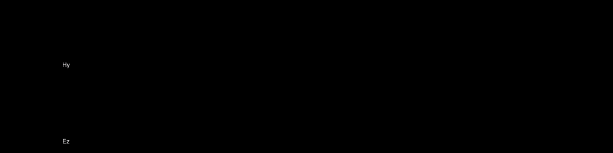

# UFDTD-Taichi

> See also the [Julia](./julia) version.

*Understanding the Finite-Difference Time-Domain Method*, implemented in [Taichi](https://taichi-lang.org/).

Table of Contents:

- [UFDTD-Taichi](#ufdtd-taichi)
  - [Chapter 3. Introduction to the FDTD method](#chapter-3-introduction-to-the-fdtd-method)
    - [1D Bare Bones](#1d-bare-bones)
    - [1D Additive](#1d-additive)
    - [1D TFSF (Total Field / Scattered Field)](#1d-tfsf-total-field--scattered-field)
    - [1D Dielectric](#1d-dielectric)
    - [1D Lossy](#1d-lossy)
    - [1D Matched](#1d-matched)
  - [Chapter 6. Differential-Equation Based Absorbing Boundary Conditions](#chapter-6-differential-equation-based-absorbing-boundary-conditions)
    - [First Order ABC](#first-order-abc)
    - [Second Order ABC](#second-order-abc)

## Chapter 3. Introduction to the FDTD method

### 1D Bare Bones

- PEC at the left boundary
- PMC at the right boundary
- Hardwired source at node 0

### 1D Additive

- PEC at the left boundary
- PMC at the right boundary
- Additive source at node 50

### 1D TFSF (Total Field / Scattered Field)

- ABC at the left boundary
- ABC at the right boundary
- TFSF boundary between `hy[49]` and `ez[50]`

### 1D Dielectric

- ABC at the left boundary
- ABC at the right boundary (not working as expected due to non-unity relative permittivity)
- TFSF boundary between `hy[49]` and `ez[50]`
- A dielectric material starting at `ez[100]`

### 1D Lossy

- ABC at the left boundary
- TFSF boundary between `hy[49]` and `ez[50]`
- A lossy dielectric material starting at `ez[100]`

### 1D Matched

- ABC at the left boundary
- TFSF boundary between `hy[49]` and `ez[50]`
- A dielectric material starting at `ez[100]`
- A lossy dielectric material starting at `ez[180]`, working as a matching layer

## Chapter 6. Differential-Equation Based Absorbing Boundary Conditions

### First Order ABC

- First order ABC at left and right boundaries
- TFSF boundary between `hy[49]` and `ez[50]`
- A dielectric material starting at `ez[100]`

### Second Order ABC

- Second order ABC at left and right boundaries
- TFSF boundary between `hy[49]` and `ez[50]`
- A dielectric material starting at `ez[100]`
